# 🌾 AgriLink

**AgriLink** is a full-stack digital agriculture marketplace built for Bangladesh. It connects **farmers**, **aratdars** (wholesale commission agents) and **retailers** on a single platform, replacing the traditional multi-layer middleman chain with a transparent, auction-based trading workflow. It also helps farmers decide *what to grow* by recommending crops based on their district, the current month/season and live weather.

The whole interface is available in **English** and **বাংলা**.

---

## Table of Contents

- [Features](#features)
- [User Roles](#user-roles)
- [How Trading Works](#how-trading-works)
- [Tech Stack](#tech-stack)
- [Project Structure](#project-structure)
- [Getting Started](#getting-started)
  - [Prerequisites](#prerequisites)
  - [Environment Variables](#environment-variables)
  - [Run with Docker (recommended)](#run-with-docker-recommended)
  - [Run Manually](#run-manually)
  - [Creating the First Admin](#creating-the-first-admin)
- [API Overview](#api-overview)
- [Frontend Routes](#frontend-routes)
- [Real-time Events (Socket.IO)](#real-time-events-socketio)
- [Security Notes](#security-notes)
- [License](#license)

---

## Features

- **Role-based platform** – separate dashboards and workflows for Farmer, Aratdar, Retailer and Admin.
- **Admin-approved registration** – sign-up with OTP verification (email or SMS); an admin must approve every new member before they can log in.
- **Product auctions** – when a farmer lists a product, a 24-hour auction is created automatically. Aratdars place bids and the farmer picks the winner.
- **Aratdar inventory** – aratdars publish their own stock; retailers browse it and place orders directly.
- **Order management** – full order lifecycle (`PENDING → CONFIRMED → PROCESSING → SHIPPED → DELIVERED`, or `CANCELLED`) with status updates by the seller.
- **Crop library & recommendations** – admins manage crops and district/season-based planting rules; anyone can get crop suggestions for their district filtered by current weather.
- **Real-time notifications** – order updates, bid results, stock alerts, report actions and announcements are pushed live over Socket.IO (with in-app notification centre and sound).
- **Reports & moderation** – users can report each other; admins review reports, issue warnings and remove members.
- **Role dashboards with charts** – analytics for each role built with Recharts.
- **Bilingual UI (EN / BN)** – language choice is persisted in a cookie (`agrilink_locale`).
- **Image uploads** – product, inventory and crop images are stored on Cloudinary.
- **Redis-backed security** – OTP storage, resend cooldown, attempt rate-limiting and weather caching.
- **Dockerized** – one command brings up the client, server, MongoDB, Redis and RedisInsight.

---

## User Roles

| Role | What they can do |
| --- | --- |
| 🧑‍🌾 **Farmer** | List products (auto-creates an auction), edit/delete products, review bids and accept a winner, receive and process orders, view dashboard analytics, get crop suggestions. |
| 🏪 **Aratdar** | Browse farmer products and place bids, create orders for won auctions, manage own inventory, receive orders from retailers and update their status, track bidding products and placed orders. |
| 🛒 **Retailer** | Browse aratdar inventory, place orders, track/cancel own orders, view dashboard analytics. |
| 🛡️ **Admin** | Approve/reject registration requests, remove members, manage the crop library and crop-recommendation rules, review user reports and issue warnings, view platform-wide dashboard. |

---

## How Trading Works

```mermaid
flowchart LR
    F[Farmer lists product] --> A[24h auction starts]
    A --> B[Aratdars place bids]
    B --> W[Auction ends - farmer selects winner]
    W --> O1[Aratdar creates order]
    O1 --> S1[Farmer updates order status]
    S1 --> I[Aratdar lists stock in inventory]
    I --> R[Retailer orders from inventory]
    R --> S2[Aratdar updates order status]
    S2 --> D[Delivered]
```



**Auction statuses:** `ACTIVE` → `ENDED` / `WAITING_FARMER_SELECTION` → `WINNER_SELECTED` → `ORDER_CREATED` (or `CANCELLED`)
**Bid statuses:** `PLACED`, `WINNER`, `LOST`, `CANCELLED`
**Order statuses:** `PENDING`, `CONFIRMED`, `PROCESSING`, `SHIPPED`, `DELIVERED`, `CANCELLED`
**Units supported:** `kg`, `mon`, `ton`, `piece`

### Registration flow

1. User submits the registration form (name, email, phone, password, role, district).
2. A 6-digit OTP is sent by **email** or **SMS** (via Brevo) and stored in Redis for 5 minutes (60-second resend cooldown, rate-limited attempts).
3. After OTP verification the request is saved as a *pending request* (auto-deleted after 3 days if not handled).
4. An admin accepts or rejects the request. On approval the user is created and receives an approval email.

### Crop suggestion flow

1. Admin creates crops (weather/water/soil requirements, cultivation tips) and *recommendation rules* (districts, planting months, season – `kharif-1`, `kharif-2`, `rabi`, `all`).
2. For a selected district, the server determines the current month/season, fetches the district's current weather (cached in Redis) and returns only the crops whose rules and weather requirements match.

---

## Tech Stack

**Frontend (`/client`)**

- [Next.js 16](https://nextjs.org/) (App Router) + [React 19](https://react.dev/) + TypeScript
- [Tailwind CSS 4](https://tailwindcss.com/) + [Framer Motion](https://www.framer.com/motion/) + [Lucide Icons](https://lucide.dev/)
- [Redux Toolkit](https://redux-toolkit.js.org/) / React-Redux for state management
- React Hook Form, Axios, React-Toastify
- [Recharts](https://recharts.org/) for dashboard charts
- Socket.IO Client for real-time updates
- Custom i18n (English / Bangla)

**Backend (`/server`)**

- Node.js 20 (ES Modules) + [Express 5](https://expressjs.com/)
- [MongoDB](https://www.mongodb.com/) with [Mongoose 9](https://mongoosejs.com/)
- [Redis](https://redis.io/) via ioredis (OTP, rate-limits, caching)
- JWT authentication (httpOnly cookie) + bcryptjs password hashing
- express-validator, Multer (memory storage), Socket.IO
- [Cloudinary](https://cloudinary.com/) for images
- [Brevo](https://www.brevo.com/) for transactional email & SMS

**DevOps**

- Docker & Docker Compose (client, server, MongoDB 7, Redis 7, RedisInsight)

---

## Project Structure

```text
AgriLink/
├── docker-compose.yml
├── .env.docker                 # Mongo / Redis URLs used inside Docker
├── LICENSE
├── client/                     # Next.js frontend
│   ├── src/
│   │   ├── app/                # App Router pages
│   │   │   ├── (auth)/         #   login, register, forgot-password
│   │   │   ├── (farmer)/       #   dashboard, my-products, receive-order
│   │   │   ├── aratdar/        #   dashboard, bidding, inventory, orders
│   │   │   ├── retailer/       #   dashboard, orders
│   │   │   ├── admin/          #   dashboard, member requests, reports
│   │   │   ├── crop/           #   crop library, suggestions, admin CRUD
│   │   │   ├── products/       #   marketplace listing + product details
│   │   │   ├── inventory/      #   aratdar inventory listing + details
│   │   │   ├── notifications/
│   │   │   └── create-reports/
│   │   ├── components/         # UI (home, auth, crop, sidebar, notification…)
│   │   ├── store/slice/        # Redux slices (auth, product, order, crop…)
│   │   ├── providers/          # Role-based route/auth providers
│   │   ├── lib/i18n/           # en / bn translations
│   │   ├── hooks/ context/ types/ constants/
│   │   └── socket.tsx
│   └── Dockerfile
└── server/                     # Express backend
    ├── index.js                # HTTP + Socket.IO bootstrap
    ├── src/
    │   ├── app.js              # Express app & route mounting
    │   ├── config/             # db, redis, mail, sms, cloudinary, socket
    │   ├── controllers/        # admin, auth, crop, dashboard, inventory,
    │   │                       # notification, order, product, report
    │   ├── models/             # Mongoose schemas
    │   ├── routes/             # Route definitions
    │   ├── middlewares/        # protect, isAdmin/isFarmer/isAratdar/isRetailer, upload
    │   ├── helpers/            # ApiErrors, ApiResponse, AsyncHandler, ErrorHandler
    │   ├── constants/          # districts, crop categories, notification types
    │   └── utils/              # Cloudinary upload helper
    └── Dockerfile
```

### Data models

`User` · `RequestUser` · `Products` · `Auction` · `Bid` · `Inventory` · `Orders` · `Crop` · `CropRecommendations` · `Notification` · `Report`

All 64 districts of Bangladesh are available as an enum for users, products and crop recommendations.

---

## Getting Started

### Prerequisites

- [Node.js](https://nodejs.org/) 20+ (for manual setup)
- [Docker](https://www.docker.com/) & Docker Compose (for the Docker setup)
- A [Cloudinary](https://cloudinary.com/) account (image uploads)
- A [Brevo](https://www.brevo.com/) account & API key (email/SMS OTP)
- A weather API key – the code expects a [WeatherAPI.com](https://www.weatherapi.com/)-style response (`current.temp_c`, `humidity`, `precip_mm`, `chance_of_rain`, `condition.text`)

### Environment Variables

**`server/.env`** (copy from `server/.env.example`)

| Variable | Description |
| --- | --- |
| `PORT` | Server port (default `5000`) |
| `CORS_ORIGIN` | Frontend origin, e.g. `http://localhost:3000` |
| `TOKEN_SECRET` | Secret used to sign JWTs |
| `TOKEN_EXPIRY` | JWT lifetime, e.g. `10d` |
| `MONGODB_URL` | MongoDB base URL – the DB name `agrilink` is appended automatically, e.g. `mongodb://localhost:27017` |
| `REDIS_URL` | Redis URL, e.g. `redis://localhost:6379` (use `rediss://` for TLS) |
| `REDIS_PREFIX` | Key prefix for Redis (default `agrilink`) |
| `CLOUDINARY_CLOUD_NAME` / `CLOUDINARY_API_KEY` / `CLOUDINARY_API_SECRET` | Cloudinary credentials |
| `BREVO_API_KEY` | Brevo API key (email + SMS) |
| `SENDER_EMAIL` | Verified sender address in Brevo |
| `WEATHER_API_URL` | Weather API "current" endpoint |
| `WEATHER_API_KEY` | Weather API key |

**`client/.env.local`**

| Variable | Description |
| --- | --- |
| `NEXT_PUBLIC_SERVER_URL` | Backend base URL, e.g. `http://localhost:5000` |

**`.env.docker`** (already included) – overrides `MONGODB_URL` and `REDIS_URL` so the server talks to the `mongo` and `redis` containers.

> ⚠️ Never commit real secrets. `.env` files are git-ignored.

### Run with Docker (recommended)

```bash
# 1. Clone
git clone https://github.com/Foridul35962/AgriLink.git
cd AgriLink

# 2. Create env files (see the tables above)
cp server/.env.example server/.env        # then fill in the values
echo "NEXT_PUBLIC_SERVER_URL=http://localhost:5000" > client/.env.local

# 3. Build & start everything
docker compose up --build
```

| Service | URL / Port |
| --- | --- |
| Client (Next.js) | http://localhost:3000 |
| Server (Express API) | http://localhost:5000 |
| MongoDB (host port) | `localhost:27018` |
| Redis (host port) | `localhost:6380` |
| RedisInsight | http://localhost:5540 |

### Run Manually

Make sure MongoDB and Redis are running locally, then:

```bash
# Backend
cd server
cp .env.example .env      # fill in values (MONGODB_URL=mongodb://localhost:27017, REDIS_URL=redis://localhost:6379)
npm install
npm start                 # runs nodemon on http://localhost:5000

# Frontend (new terminal)
cd client
npm install
echo "NEXT_PUBLIC_SERVER_URL=http://localhost:5000" > .env.local
npm run dev               # http://localhost:3000
```

Other client scripts: `npm run build`, `npm run start`, `npm run lint`.

### Creating the First Admin

Public registration only allows the `farmer`, `aratdar` and `retailer` roles, so the first **admin** has to be inserted directly into the `users` collection of the `agrilink` database. The `password` must be a **bcrypt hash** (not plain text):

```js
// mongosh
use agrilink
db.users.insertOne({
  name: "Admin",
  email: "admin@example.com",
  phoneNumber: "01XXXXXXXXX",
  password: "<bcrypt-hash-of-your-password>",
  role: "admin",
  district: "Dhaka",
  createdAt: new Date(),
  updatedAt: new Date()
})
```

> Passwords must be at least 8 characters and contain letters and numbers.

---

## API Overview

Base URL: `http://localhost:5000/api` — authentication uses an **httpOnly `token` cookie**, so requests from the client must be sent with credentials.

| Module | Endpoint | Access |
| --- | --- | --- |
| **Auth** `/auth` | `POST /registration` · `POST /verify-regi` · `POST /login` · `GET /logout` · `POST /forget-pass` · `POST /verify-forget-pass` · `PATCH /reset-pass` · `POST /resend-otp` · `GET /me` | Public (`/me` needs login) |
| **Admin** `/admin` | `GET /user-request` · `POST /user-request-accept` · `POST /user-request-reject` · `DELETE /remove-member` · `GET /dashboard` | Admin |
| **Product** `/product` | `POST /add` · `PATCH /edit/:productId` · `DELETE /delete/:productId` · `GET /all-my-product` · `POST /accept-bid` | Farmer |
| | `POST /add-bid` · `POST /create-order` · `GET /my-bidding` | Aratdar |
| | `GET /all` · `GET /product/:productId` | Any logged-in user |
| **Inventory** `/inventory` | `POST /add` · `PATCH /edit/:inventoryId` · `DELETE /delete/:inventoryId` · `GET /my` | Aratdar |
| | `POST /create-order` | Retailer |
| | `GET /all` · `GET /details/:inventoryId` | Any logged-in user |
| **Order** `/order` | `GET /farmer-receive` · `GET /farmer-receive-details/:orderId` · `PATCH /farmer-change-status/:orderId` | Farmer |
| | `GET /aratdar-placed` · `GET /farmer-placed-details/:orderId` · `GET /aratdar-received` · `GET /aratdar-received-details/:orderId` · `PATCH /aratdar-change-status/:orderId` | Aratdar |
| | `GET /retailer-placed` · `GET /retailer-placed-details/:orderId` · `PATCH /cancel` | Retailer |
| **Crop** `/crop` | `POST /create` · `PATCH /update/:cropId` · `DELETE /delete/:cropId` · `POST /create-recommendation` · `PATCH /update-recommendation` · `DELETE /delete-recommendation/:id` | Admin |
| | `GET /all` · `GET /details/:cropId` · `GET /suggestion/:districts` | Public |
| **Dashboard** `/dashboard` | `GET /farmer` · `GET /aratdar` · `GET /retailer` | Respective role |
| **Report** `/report` | `POST /create` | Any logged-in user |
| | `GET /all-reports` · `GET /report/:reportId` · `PATCH /warning` · `POST /view-done` | Admin |
| **Notification** `/notification` | `GET /all` · `GET /unread-count` · `PATCH /read/:id` · `PATCH /read-all` · `DELETE /delete/:id` | Any logged-in user |

---

## Frontend Routes

| Area | Routes |
| --- | --- |
| **Public / Auth** | `/` (landing page) · `/login` · `/register` · `/forgot-password` · `/crop` · `/crop/[cropId]` · `/crop/suggestions` |
| **Shared (logged in)** | `/products` · `/products/[productId]` · `/inventory` · `/inventory/[inventoryId]` · `/notifications` · `/create-reports/[reportedUserId]` |
| **Farmer** | `/dashboard` · `/my-products` · `/my-products/add` · `/my-products/edit/[productId]` · `/receive-order` · `/receive-order/[orderId]` |
| **Aratdar** | `/aratdar` · `/aratdar/bidding-products` · `/aratdar/inventory` · `/aratdar/inventory/add` · `/aratdar/inventory/edit/[inventoryId]` · `/aratdar/order/placed` · `/aratdar/order/received` |
| **Retailer** | `/retailer` · `/retailer/order` · `/retailer/order/[orderId]` |
| **Admin** | `/admin` · `/admin/members/request` · `/admin/reports` · `/admin/reports/[reportId]` · `/crop/create` · `/crop/edit/details/[cropId]` · `/crop/edit/recommendation/[cropId]` |

---

## Real-time Events (Socket.IO)

The server exposes Socket.IO on the same port as the API. Clients join rooms to receive targeted updates:

| Client event | Room joined | Purpose |
| --- | --- | --- |
| `joinUser` `{ userId }` | `user:<userId>` | Personal notifications |
| `joinBidding` / `leaveBidding` `{ auctionId }` | `auction:<auctionId>` | Live bid updates on a product |
| `joinInventory` / `leaveInventory` `{ inventoryId }` | `inventory:<inventoryId>` | Live stock updates on an inventory item |

Notification types include order lifecycle events, `BID_WON`, payment events, product approval/stock alerts (`LOW_STOCK`, `OUT_OF_STOCK`), report events, `WARNING`, `ANNOUNCEMENT` and more.

---

## Security Notes

- Passwords are hashed with **bcrypt**; JWTs are stored in **httpOnly, secure, sameSite=none** cookies.
- OTP endpoints are protected by Redis-based **rate limiting** and **resend cooldowns**.
- Role middlewares (`isAdmin`, `isFarmer`, `isAratdar`, `isRetailer`) guard every protected route.
- Input is validated on the server with **express-validator**.
- Pending registrations automatically expire after **3 days**.

---

## License

This project is licensed under the **MIT License** — see the [LICENSE](LICENSE) file for details.

© 2026 MD Foridul Ibne Qauser